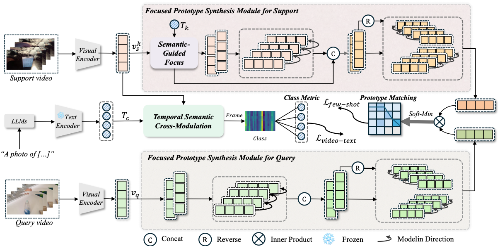

## Semantic-Temporal Adaptive Representation Learning for Few-Shot Action Recognition (TCSVT-2026)

## Update

Additional STAR models and related resources are coming soon. We are currently organizing the extra models, and will release them as soon as the cleanup is complete.



> **Semantic-Temporal Adaptive Representation Learning for Few-Shot Action Recognition**<br>
> Hongli Liu · Yu Wang<sup>\*</sup> &nbsp;· Shengjie Zhao<sup>\*</sup><br>
> <sup>*</sup> Corresponding author
>
>
> **Abstract:** *Few-shot action recognition (FSAR) requires models to generalize to novel action categories from only a handful of annotated samples. 
Despite progress with vision–language models, existing approaches still suffer from semantic–temporal misalignment, where static textual prompts fail to capture decisive visual cues that appear sparsely across sequences, and from inadequate modeling of multi-scale temporal dynamics, as short-term discriminative cues and long-range dependencies are often either oversmoothed or fragmented.
To address these challenges, we propose Semantic Temporal Adaptive Representation Learning (STAR), a unified framework, consisting of a semantic-alignment component and a temporal-aware component, effectively bridging the semantic and temporal gaps and transferring the sequence modeling capability of Mamba into the FSAR. 
The semantic alignment module introduces a Temporal Semantic Attention (TSA) mechanism, which performs frame-level cross-modal alignment with textual cues, ensuring fine-grained semantic--temporal consistency. 
The temporal-aware module incorporates a Semantic Temporal Prototype Refiner (STPR) that integrates semantic-guided Mamba blocks with multi-frequency temporal sampling and bidirectional state-space refinement, yielding semantically aligned prototypes with enhanced discriminative fidelity and temporal consistency.
Furthermore, temporally dependent class descriptors derived from large language models (LLMs) provide long-range semantic guidance. Extensive experiments on five FSAR benchmarks demonstrate the consistent superiority of STAR over state-of-the-art methods. For instance, STAR achieves up to 8.1\% and 6.7\% gains on the SSv2-Full and SSv2-Small datasets under the 1-shot setting, and 7.3\% on HMDB51, validating its effectiveness under limited supervision.*
. 

## Installation

Requirements:

- Python>=3.10
- CUDA Toolkit>=11.8
- torch>=2.1.1
- torchvision>=0.16.1
- torchaudio>=2.1.1
- mamba-ssm>=1.0.1
- causal-conv1d>=1.0.0
- decord>=0.6.0
- einops>=0.8.1
- pyyaml>=6.0.2
- yacs>=0.1.8
- oss2>=2.19.1
- psutil>=7.0.0
- tqdm>=4.67.1
- pandas>=2.3.0
- scikit-learn>=1.7.2
- matplotlib>=3.10.3
- timm>=1.0.15
- transformers>=4.52.4

Or you can create environments with the following command:
```
conda env create -f environment.yaml
```

## Data preparation

First, you need to download the datasets from their original source (If you have already downloaded, please ignore this step
):

- [SSV2](https://20bn.com/datasets/something-something#download)
- [Kinetics](https://github.com/Showmax/kinetics-downloader)
- [UCF101](https://www.crcv.ucf.edu/data/UCF101.php)
- [HMDB51](https://serre-lab.clps.brown.edu/resource/hmdb-a-large-human-motion-database/#Downloads)

Then, prepare data according to the [splits](configs/projects/MoLo) we provide.

## Running
The entry file for all the runs are `runs/run.py`. 

Before running, some settings need to be configured in the config file. 
The codebase is designed to be experiment friendly for rapid development of new models and representation learning approaches, in that the config files are designed in a hierarchical way.

For an example run, open `configs/projects/CLIPFSAR/kinetics100/CLIPFSAR_K100_1shot_v1.yaml`

A. Set `DATA.DATA_ROOT_DIR` and `DATA.DATA_ANNO_DIR` to point to the kinetics dataset, 

B. Set the valid gpu number `NUM_GPUS`

Then the codebase can be run by:
```
python runs/run.py --cfg configs/projects/CLIPFSAR/kinetics100/CLIPFSAR_K100_1shot_v1.yaml
```

## Citation
If you find this code useful, please cite our paper.

## Acknowledgement

This project is developed based on [CLIP-FSAR](https://github.com/alibaba-mmai-research/CLIP-FSAR), 
which is released under the Apache-2.0 License.
Modifications and newly added components are maintained by the STAR authors.